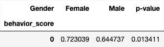

<!-- markdownlint-disable MD013 -->
<!-- markdownlint-disable MD033 -->

# Results

Data obtained from the survey conducted between 24 September 2023 and 27 September 2024 using Google Forms consisted of **408** respondents. Students not studying at the University of Gezira were excluded, leaving **401** participants. The distribution of these students across academic levels was as follows:

| Academic Year | Students |
|--|--|
| **First year** | 54 |
| **Second year** | 61 |
|**Third year**|92|
| **Fourth year** | 86 |
| **Fifth year** | 108 |

When broken down by **faculty**, the distribution was:

| Academic Year | Faculty   | Students |
|---------------|-----------|----------|
| First year    | Medicine  | 46       |
|               | Dentistry | 8        |
| Second year   | Medicine  | 46       |
|               | Dentistry | 15       |
| Third year    | Medicine  | 101      |
|               | Dentistry | 7        |
| Fourth year   | Medicine  | 65       |
|               | Dentistry | 21       |
| Fifth year    | Medicine  | 83       |
|               | Dentistry | 9        |

Applying the original inclusion and exclusion criteria (1st, 3rd, and 5th years only) would have reduced the sample size from 401 to 254, which would substantially compromise:

- Statistical power (increasing the margin of error)
- Generalizability of findings
- Validity of between-group comparisons

To avoid these limitations, **all academic levels** were retained for the analysis. While group sizes were imbalanced, appropriate statistical tests were applied to account for this. Nonetheless, given the smaller subgroup sizes, some statistically significant results may be attributable to random variation.

**Faculty distribution:** 85% Medicine (n = 341) and 15% Dentistry (n = 60)

| Faculty | Students |
|--|--|
| Dentistry | 60 |
| Medince | 341 |

**Gender distribution:** 76% Female (n = 306) and 24% Male (n = 95)

| Gender | Students |
|--|--|
| Female | 306 |
| Male | 95 |

Given these proportions, findings, particularly those related to gender or faculty-specific trends should be interpreted with caution due to potential sampling bias.

## **Scoring & Analyzing Knowledge**

For the six knowledge-based questions, responses allowed multiple selections. Each question was worth one point in total. For questions with multiple correct answers, the point was divided equally among correct options. For example, if a question had three correct answers, each correct selection contributed approximately 0.333 points toward the total score.

Initial analyses examined the **proportion** of students selecting each correct option per question, stratified by academic level and faculty. Chi-square tests revealed substantial variability in p-values when stratifying by academic level—some questions produced very high p-values (indicating no significant difference), while others showed low p-values. This inconsistency is likely due to reduced statistical power from small subgroup sizes.

   
  <em>Table 1. Causes of dental caries per academic level and faculty</em>

   
  <em>Table 2. Causes of dental caries per faculty</em>

   
  <em>Table 3. Causes of Bleeding during tooth brushing per academic level and faculty</em>

   
  <em>Table 4. Causes of Bleeding during tooth brushing per faculty</em>

The two questions here an example of the great variations of the p-value calculated using  **chi-square test.**

When comparing faculties without stratifying by academic level, p-values were more stable, benefiting from larger group sizes. Some questions still yielded high p-values, but others demonstrated meaningful differences between faculties.

### **Aggregated Knowledge Score Analysis**

To address the limitations of chi-square testing on proportions, a **mean knowledge score** was calculated for each student (averaging across all six questions). This allowed the use of **t-tests**, which are more robust for continuous data and better suited for detecting overall differences.

   
  <em>Figure 1. Proportion answered correctly by faculty for knowledge questions</em>

   
  <em>Table 5. Knowledge questions scores per academic level and faculty</em>

   
  <em>Table 6. Knowledge questions scores per faculty</em>

There's still great variability when you take in consideration sub-groups but this provide more meaningful information compared to comparing the proportions selecting each option for the different questions that measure knowledge.

The aggregated analysis indicated a **slight but a varied statistically significant** advantage for dental students compared to medical students. However, the effect size was small, and visual inspection showed substantial overlap in score distributions.

The p-values when you compare results based on faculty also here a potential sufficient significance in order for us to reject the null hypothesis showing there might be an actual difference between medical students and dental students which wasn't evident before using the chi-square test when comparing question options against each other.

Knowledge was scored as a whole using the mean of the 6 questions together to calculate a collective knowledge score per student to demonstrate if there's an evident difference. The following demonstrates the distribution of knowledge score per academic level and faculty.

**Descriptive Analytics for Score of Knowledge of Healthcare students:**

| **Statistic** | **Value** |
| ------------- | --------- |
| **Mean**      | 0.53      |
| **Mode**      | 0.54      |
| **Median**    | 0.54      |
| **Std**       | 0.20      |
| **Variance**  | 0.043     |

   
  <em>Figure 2. Knowledge scores per academic level and faculty</em>

   
  <em>Figure 3.Interaction Plot:  Knowledge scores per academic level and faculty</em>

   
  <em>Table 7. Knowledge score per academic level and faculty</em>

The interaction plot and bar plot above shows that, across most academic levels, dental students have slightly higher mean knowledge scores compared to medical students, with the largest gap observed in the 4th year. However, the error bars (representing the standard error of the mean) are notably wide for dentistry, especially in the 3rd and 4th years. This indicates considerable variability within the dental student group and overlapping confidence intervals between the two faculties at most academic levels. Such overlap suggests that, despite the apparent trend in mean scores, the differences are not statistically robust and may be due to random variation rather than a consistent faculty-level effect.

   
  <em>Figure 3: Knowledge score for Dentistry vs Medicine</em>

   
  <em>Table 8: Knowledge score per faculty</em>

> **H₀ (Null):** There is no significant difference in oral health knowledge scores between dental and medical students at University of Gezira.
>
> The hypothesis  **can NOT be rejected**  in respective to all questions that measure knowledge, showing that dental students superiority in knowledge can’t be measured with the current data.

The significance of difference of knowledge score between medical and dental students for the current sample as a collective of all questions is not evident enough, thus we can’t confirm that there’s a difference between medical and dental students.

When broken down by academic level, the largest difference appeared in the **fourth year**, where dental students outperformed medical students. In other years, distributions overlapped considerably, and p-values did not support rejecting the null hypothesis of no difference between academic levels.

> **H₀ (Null):** There is no significant difference in oral health knowledge among 1st, 3rd, and 5th year students.
>
> P-values don’t signify a statistical difference that rules out the hypothesis.

## **Scoring and Analyzing Oral health behavior**

The following metrics were considered positive oral health behavior:

- Frequency of daily tooth brushing **(≥ twice)**
- Duration of tooth brushing **(≥ 2 min)**
- Frequency of replacing toothbrush **(≤ 3 months)**
- Frequency of visiting the dentist **(regularly)**

For each behavior question (Q1–Q4), a score is assigned of 1 if a student’s answer matches the “correct” or positive behavior, and 0 otherwise. This means each student’s response to each question is treated as a binary outcome: correct (1) or incorrect (0).

To compare groups (such as Dentistry vs Medicine, or different academic levels), the proportion of students are looked at in each group who answered each question correctly. For example, you might find that 80% of Dentistry students answered Q1 correctly, compared to 60% of Medicine students.

To test whether these differences in proportions are statistically significant, we use **Fisher’s exact test**. This test is especially useful when groups are small or imbalanced, as it gives an exact p-value for the difference in proportions between groups.

   
  <em>Figure 4: Duration of tooth brushing more than 2 mins per academic level and faculty</em>

   
  <em>Figure 5: Frequency of daily tooth brushing more than twice per academic level and faculty</em>

   
  <em>Table 9: Behavior Analysis Proportions Questions per Academic level and Faculty</em>

   
  <em>Table 10: Behavior Analysis Proportions Questions per Faculty</em>

It’s difficult to find significance between the different academic levels but the differences are clear and statistically significant comparing the two faculties for 5 out of 6 of the questions.

It seems like the null hypothesis (comparing the two faculties in terms of behavior) is highly possible to be rejected. Final call will be left to the final calculation of the behavior_score (the mean of the 4 behavior questions).

### **Aggregated Behavior Score Analysis**

   
  <em>Figure 6: Behavior Score per Academic Level and Faculty</em>

   
  <em>Figure 7: Distribution of Behavior Scores per Faculty</em>

   
  <em>Figure 8: Interaction Plot Behavior Score per Academic level and Faculty</em>

Even though using behavior score doesn’t bring distinct differences between academic levels, the slight differences are statistically significant, in addition to that, the behavior of dental students compared to medical students is relatively better regarding oral health by a differnce of 85% to 67%.

   
  <em>Table 11: Behavior Analysis Score per Faculty</em>

   
  <em>Table 12: Behavior Analysis Score per Academic level and Faculty</em>

> **H₀ (Null):** There is no significant difference in oral health behaviors between dental and medical students at University of Gezira.
>
> This null hypothesis can be confidently  **rejected**, signifying that there is a near 20% difference between oral health behavior of dental and medical students.

With that said, because the p-values from separate year-by-year comparisons vary drastically, it is unclear whether these differences reflect a consistent pattern or are due to random variation. Performing multiple independent tests increases the risk of  **Type I error**  (false positives), meaning that some ‘significant’ results might occur purely by chance. **A two-way ANOVA** addresses this by assessing the overall effects of Faculty and Academic Level, as well as their interaction, within a single model. This not only controls for the inflation of Type I error but also provides a clearer picture of whether the observed differences are systematic across years or isolated to certain levels.

   
  <em>Table 13: Two-way ANOVA Test for Behavior Analysis</em>

For Academic level, p-value = 0.1938 → greater than 0.05. Demonstrating that there's no statistical significant difference in behavior scores between academic levels (at least in this sample).

But for faculty, p-value = 0.000003 → far less than 0.05. Demonstrating a statistically significant difference in behavior scores between Dentistry and Medicine students.

There's  **NO**  evidence that academic level itself or its interaction with faculty changes behavior scores in this dataset.

> **H₀ (Null):** There is no significant difference in oral health behaviors among 1st, 3rd, and 5th year students.
>
> — Can’t be rejected!

   
  <em>Table 14: Behavior Analysis Score per Gender</em>

While the difference in behavior scores between males and females is statistically significant, it explains only 8% of the variance, indicating that the practical impact of gender on behavior scores is relatively modest.

**Descriptive Analytics for Score of Behavior of Healthcare students:**

| **Statistic** | **Value** |
| ------------- | --------- |
| **Mean**      | 0.70      |
| **Mode**      | 0.75      |
| **Median**    | 0.75      |
| **Std**       | 0.25      |
| **Variance**  | 0.065     |

### Distribution of Brushing Techniques

   
  <em>Table 15: Methods of Tooth Brushing per Academic level and Faculty</em>

   
  <em>Table 16: Methods of Tooth Brushing per Faculty</em>

   
  <em>Figure 9: Distribution of Methods of Tooth Brushing per Faculty</em>

The **Modified Bass Technique**  is considered the most effective for plaque removal and gum health, involving gentle, thorough cleaning around the gumline with small, vibrating strokes  [(16)](https://pubmed.ncbi.nlm.nih.gov/16451532/).

The highest proportion of dental students reported using this technique, reflecting the influence of their education on their oral health–related brushing behavior.

### Distribution of Oral Hygiene Methods

   
  <em>Figure 10: Distribution of Oral Hygiene Methods per Faculty</em>

   
  <em>Table 17: Oral Hygiene Methods per Academic level and Faculty</em>

   
  <em>Table 18: Oral Hygiene Methods per Faculty</em>

Most oral hygiene–related proportional differences were not statistically significant, except for  **dental floss**  use. A substantially higher proportion of dental students reported using dental floss compared to medical students (81% vs. 25%), and this difference was highly statistically significant.

**Sugar-free chewing gum**  (p = 0.01) and  **None**  (p = 0.00) are also statistically significant, but the effect sizes are smaller compared to dental floss.

## **Scoring and Analyzing Oral Health Status**

   
  <em>Figure 11. Distribution of Oral Problems per Faculty</em>

   
  <em>Table 19. Oral Health Problems per Academic level and Faculty</em>

   
  <em>Table 20. Oral Health Problems per Faculty</em>

There’s no specific oral health problem that is related or evident within a specific group.

For the purpose of calculating oral health status collectively, a student’s status was coded as  _True_  if they reported ‘No Problem’ and did not select any other oral health condition. Otherwise, the status was coded as  _False_.

   
  <em>Table 21. Oral Health Status Score per Academic level and Faculty</em>

   
  <em>Table 22. Oral Health Status Score per Faculty</em>

   
  <em>Table 23. Oral Health Status Score per Gender</em>

   
  <em>Figure 12. Proportions of students with Good Oral Health per Academic level</em>

   
  <em>Figure 13. Proportions of students with Good Oral Health per Faculty</em>

Even though, dental students report relatively better oral health status, the difference was not statistically significant enough and therefore the related null hypothesis could not be rejected. This outcome is most likely attributable to sampling variability and the imbalance in group sizes.

> **H₀ (Null):** There is no significant difference in oral health status between dental and medical students at University of Gezira.
>
> — Can’t be rejected!

Oral health status in relation to knowledge levels could not be meaningfully assessed, as no clear trend or statistically significant differences were observed between faculties across academic levels. The same conclusion applies to gender differences, which did not reach statistical significance.

> **H₀ (Null):** There is no significant difference in oral health status among 1st, 3rd, and 5th year students.
>
> **H₀ (Null):** There is no significant difference in genders in oral health status.
>
> — Can’t be rejected!

Although dental students show significantly better oral health behaviors, this advantage does not translate into measurable differences in oral health status. Knowledge scores, while slightly higher in dental students, were not statistically significant. This suggests that behavior — rather than knowledge — may be the main driver of better oral health outcomes.
